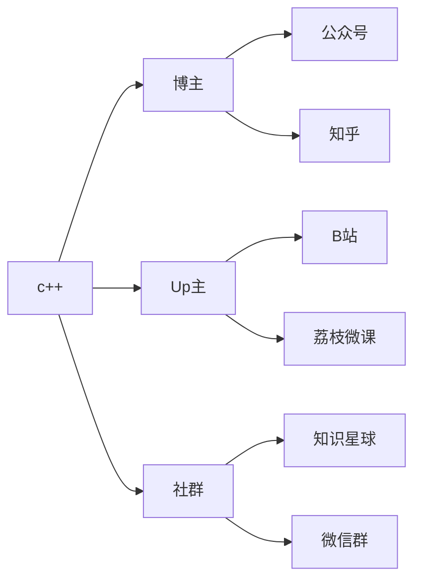

> 首先

# 信息在计算机中的表示

用0和1表示各种信息

- 计算机电路由逻辑门电路组成，一个逻辑门电路可以看成一个开关，每个开关的状态是“开”（高电位）或“关”（低电位），即对应于1或0
- 二进制数的一位，取值只能是0或1，称为一个“比特”（bit），简写：b
- 八个二进制数称为一个“字节”（byte），简写：B
- $1024(2^{10})$字节称为1KB，1024KB称为1MB（1兆），1024MB称为1GB，1024GB称为1TB
- 0和1足以表示和传播各种信息

​         8个连续的0或1表示一个字母，用“00100000”表示空格。ASCII编码方案 

​        图片、视频和可执行程序，也可以用0和1表示


## 进制转换

- k进制到十进制数的转换


- 十进制到k进制的转换——短除法


# **判断**

# **if语句**

一个 **if 语句** 由一个布尔表达式后跟一个或多个语句组成。


```
if(boolean_expression)
{    
    // 如果布尔表达式为真将执行的语句
}
```


# **if else**

一个 **if 语句** 后可跟一个可选的 **else 语句**，else 语句在布尔表达式为假时执行。


C++ 中 **if...else** 语句的语法：


```
if(boolean_expression)
{    
    // 如果布尔表达式为真将执行的语句
}
else
{    
   // 如果布尔表达式为假将执行的语句
}
```


## **if...else if...else 语句**

一个 **if** 语句后可跟一个可选的 **else if...else** 语句，这可用于测试多种条件。

当使用 if...else if...else 语句时，以下几点需要注意：

- 一个 if 后可跟零个或一个 else，else 必须在所有 else if 之后。
- 一个 if 后可跟零个或多个 else if，else if 必须在 else 之前。
- 一旦某个 else if 匹配成功，其他的 else if 或 else 将不会被测试。


```
if(boolean_expression 1)
{    
     // 当布尔表达式 1 为真时执行
}
else if( boolean_expression 2)
{    
     // 当布尔表达式 2 为真时执行
 }
else if( boolean_expression 3)
{    
     // 当布尔表达式 3 为真时执行
}
else  
{    
    // 当上面条件都不为真时执行
}
```


# 变量

- 变量就是一个代号，程序运行时系统会自动为变量分配内存空间，于是<u>变量就代表了系统分配的那片内存空间</u>，对变量的访问，就是对其代表的内存空间的访问
- 变量有名字和类型两种属性，不同变量的名字就对应了内存中不同地址，变量的类型，决定了一个变量占用多少字节。

```c
int number,price;//定义整型变量

一个变量不能定义两次
int number;
double number;//×
```


### sizeof

用sizeof运算符求变量占用字节数

```c++
sizeof(变量名)
sizeof(类型名)
    
    int n1=10;
    double f;
    char c;
			printf("%d,%d,%d,%d",sizeof(n1),sizeof(short),sizeof(double),sizeof(c));
```

> 输出;4,2,8,1


%d表示要输出一个整数

%c表示读入一个字符，不会跳过空格


scanf是执行输入功能的一个“函数”。&a表示要把输入的整数放入变量a


# 字符串

## 字符串的形式

1、用双括号括起来的字符串常量，如“CHINA”，“C++program”

2、存放于字符数组中，以'\0'字符结尾

3、string对象


C++ 中有大量的函数用来操作以 null 结尾的字符串:

| 序号 | 函数 & 目的                                                  |
| :--- | :----------------------------------------------------------- |
| 1    | **strcpy(s1, s2);** 复制字符串 s2 到字符串 s1。              |
| 2    | **strcat(s1, s2);** 连接字符串 s2 到字符串 s1 的末尾。连接字符串也可以用 **+** 号，例如: `string str1 = "runoob"; string str2 = "google"; string str = str1 + str2;` |
| 3    | **strlen(s1);** 返回字符串 s1 的长度。                       |
| 4    | **strcmp(s1, s2);** 如果 s1 和 s2 是相同的，则返回 0；如果 s1<s2 则返回值小于 0；如果 s1>s2 则返回值大于 0。 |
| 5    | **strchr(s1, ch);** 返回一个指针，指向字符串 s1 中字符 ch 的第一次出现的位置。 |
| 6    | **strstr(s1, s2);** 返回一个指针，指向字符串 s1 中字符串 s2 的第一次出现的位置。 |

下面的实例使用了上述的一些函数：

## 实例

```c++
#include <iostream> 
#include <cstring>  
using namespace std;  
int main () {   
    char str1[13] = "runoob";   
    char str2[13] = "google";   
    char str3[13];   int  len ;    
    // 复制 str1 到 str3   
    strcpy( str3, str1);   
    cout << "strcpy( str3, str1) : " << str3 << endl;    
    // 连接 str1 和 str2   
    strcat( str1, str2);   
    cout << "strcat( str1, str2): " << str1 << endl;    
    // 连接后，str1 的总长度   
    len = strlen(str1);   
    cout << "strlen(str1) : " << len << endl;    
    return 0; 
}
```

当上面的代码被编译和执行时，它会产生下列结果：

```
strcpy( str3, str1) : runoob
strcat( str1, str2): runoobgoogle
strlen(str1) : 12
```

## C++ 中的 String 类

C++ 标准库提供了 **string** 类类型，支持上述所有的操作，另外还增加了其他更多的功能。我们将学习 C++ 标准库中的这个类，现在让我们先来看看下面这个实例：

现在您可能还无法透彻地理解这个实例，因为到目前为止我们还没有讨论类和对象。所以现在您可以只是粗略地看下这个实例，等理解了面向对象的概念之后再回头来理解这个实例。

## 实例

```c++
#include <iostream> 
#include <string>  
using namespace std;  
int main () {   
    string str1 = "runoob";   
    string str2 = "google";   
    string str3;   int  len ;    
    // 复制 str1 到 str3   str3 = str1;   
    cout << "str3 : " << str3 << endl;    
    // 连接 str1 和 str2   str3 = str1 + str2;   
    cout << "str1 + str2 : " << str3 << endl;    
    // 连接后，str3 的总长度   
    len = str3.size();   cout << "str3.size() :  " << len << endl;    
    return 0; 
}
```

当上面的代码被编译和执行时，它会产生下列结果：

```
str3 : runoob
str1 + str2 : runoobgoogle
str3.size() :  12
```


## 用scanf读入字符串

- 用scanf可以将字符串读入字符数组
- scanf会自动添加结尾的'\0'
- scanf读入空格为止

```c
char line[100];
scanf("%s",line);//注意，不是&line
printf("%s",line);
```

> Fox River↙
>
> Fox


<string.h>是旧的C 头文件，对应的是基于char*的字符串处理函数；<string>
是包装了std 的C++头文件，对应的是新的string 类（看下文）；<cstring>是对
应于旧C 头文件的std 版本。如果能掌握这些（我相信你能），其余的也就容易
了。

 

<string>是c++ 的头文件，其内包含了一个string类，string s1就是建立一个string类的对象 

<string.h> 的c语言的东西 并无类，所以不能 string s1 

<cstring>文件实际上只是在一个命名空间std中include了 <string.h>


> 计算机只会一步一步来满足要求
>
> 算法：解决问题的步骤，计算机做的所有事情都叫做计算，计算的步骤叫做算法


**程序的执行**：解释语言vs编译语言

- 解释：借助一个程序，那个程序能试图理解你的程序，按照你的要求执行
- 编译；翻译成计算机能够读懂的语言——机器语言


> 计算机里的CPU可以直接运行人类编写的程序吗？为什么说编程语言不是和计算机交谈的语言？

A：不可以。因为人类编写的程序是人类的语言，需要通过翻译官编译成计算机能够理解的语言给计算机。计算机再执行。

> 编译执行与解释执行
>
> 有的编程语言，源代码经过编译后形成目标代码，但是这样的目标代码不能直接在CPU上执行，而是需要由一个仿真器程序来解释执行。这样的执行方式是编译的还是解释的？

认为是解释型，因为若只按照这节课上讲的，严扣定义，它编译后形成的代码，不能直接在CPU上运行，还需要一个程序来解释执行。
"翻译"后的代码，可直接在CPU上运行，则为编译。

"翻译"后的代码，不能在CPU上直接运行，需要一个程序能理解你的代码，替你指挥CPU执行，则为解释。

拓展:
①这里说的应该是Java语言，
首先语言无解释与编译之分，只是习惯哪种方式来执行。

②Java的执行方式通常是先编译后解释，所以不如纯编译性语言(C/C++)快。

③Java代码(.java)先编译成字节码文件(.class)，然后交给Java解释器(JVM Java virtual machine，即Java虚拟机)解释执行字节码文件。所以Java拥有号称"一次编译，到处执行"的跨平台性。(所以不管Windows、Linux...什么系统，只要系统上有JVM)

# 指针

- 每个变量都被存放在某个内存地址（以字节为单位）开始的若干个字节中
- “指针”也称“指针变量”，大小为4个字节或8个字节的变量，其内容代表一个内存地址
- 通过指针，能够对该指针指向的内存区域进行读写
- 每一个变量都有一个内存位置，每一个内存位置都定义了可使用 **&** 运算符访问的地址，它表示了在内存中的一个地址。

请看下面的实例，它将输出定义的变量地址：

实例

```c
#include <stdio.h>  
int main () {    
	int var_runoob = 10;    
	int *p;              // 定义指针变量    
	p = &var_runoob;    
	printf("var_runoob 变量的地址： %p\n", p);   
	return 0; 
}
```

> var_runoob 变量的地址： 0x7ffeeaae08d8


## 什么是指针？

指针也就是内存地址，指针变量是用来存放内存地址的变量。就像其他变量或常量一样，您必须在使用指针存储其他变量地址之前，对其进行声明。指针变量声明的一般形式为：

```
type *var_name;
```

在这里，**type** 是指针的基类型，它必须是一个有效的 C 数据类型，**var_name** 是指针变量的名称。用来声明指针的星号 ***** 与乘法中使用的星号是相同的。但是，在这个语句中，**星号是用来指定一个变量是指针**。以下是有效的指针声明：

```
int    *ip;    /* 一个整型的指针 */ 
double *dp;    /* 一个 double 型的指针 */ 
float  *fp;    /* 一个浮点型的指针 */ 
char   *ch;    /* 一个字符型的指针 */
```

所有实际数据类型，不管是整型、浮点型、字符型，还是其他的数据类型，**对应指针的值的类型都是一样的，都是一个代表内存地址的长的十六进制数。**

不同数据类型的指针之间唯一的不同是，**指针所指向的变量或常量的数据类型不同。**

## 如何使用指针？

使用指针时会频繁进行以下几个操作：定义一个指针变量、把变量地址赋值给指针、访问指针变量中可用地址的值。这些是通过使用一元运算符 ***** 来返回位于操作数所指定地址的变量的值。

## 实例

```c
#include <stdio.h>  int main () 
{   
    int  var = 20;   /* 实际变量的声明 */   
    int  *ip;        /* 指针变量的声明 */    
    ip = &var;  /* 在指针变量中存储 var 的地址 */    
    printf("var 变量的地址: %p\n", &var  );    /* 在指针变量中存储的地址 */           printf("ip 变量存储的地址: %p\n", ip );    /* 使用指针访问值 */                   printf("*ip 变量的值: %d\n", *ip );    
    return 0; 
}
```

> var 变量的地址: 0x7ffeeef168d8
> ip 变量存储的地址: 0x7ffeeef168d8
> *ip 变量的值: 20


> 

## C 中的 NULL 指针

在变量声明的时候，如果没有确切的地址可以赋值，为指针变量赋一个 NULL 值是一个良好的编程习惯。赋为 NULL 值的指针被称为**空**指针。

NULL 指针是一个定义在标准库中的值为零的常量。

```c
#include <stdio.h>  int main () 
{   
    int  *ptr = NULL;    
    printf("ptr 的地址是 %p\n", ptr  );    
    return 0; 
}
```

> ptr 的地址是 0x0

在大多数的操作系统上，程序不允许访问地址为 0 的内存，因为该内存是操作系统保留的。然而，内存地址 0 有特别重要的意义，它表明该指针不指向一个可访问的内存位置。但按照惯例，如果指针包含空值（零值），则假定它不指向任何东西。

如需检查一个空指针，您可以使用 if 语句，如下所示：

```
if(ptr)     /* 如果 p 非空，则完成 */ if(!ptr)    /* 如果 p 为空，则完成 */
```

C 指针是一个用数值表示的地址。因此，您可以对指针执行算术运算。可以对指针进行四种算术运算：++、--、+、-。

假设 **ptr** 是一个指向地址 1000 的整型指针，是一个 32 位的整数，让我们对该指针执行下列的算术运算：

```
ptr++
```

在执行完上述的运算之后，**ptr** 将指向位置 1004，因为 ptr 每增加一次，它都将指向下一个整数位置，即当前位置往后移 4 字节。这个运算会在不影响内存位置中实际值的情况下，移动指针到下一个内存位置。如果 **ptr** 指向一个地址为 1000 的字符，上面的运算会导致指针指向位置 1001，因为下一个字符位置是在 1001。

我们概括一下：

- 指针的每一次递增，它其实会指向下一个元素的存储单元。
- 指针的每一次递减，它都会指向前一个元素的存储单元。
- 指针在递增和递减时跳跃的字节数取决于指针所指向变量数据类型长度，比如 int 就是 4 个字节。

## 递增一个指针

我们喜欢在程序中使用指针代替数组，因为变量指针可以递增，而数组不能递增，数组可以看成一个指针常量。下面的程序递增变量指针，以便顺序访问数组中的每一个元素：

```
\#include <stdio.h>  const int MAX = 3;  int main () {   int  var[] = {10, 100, 200};   int  i, *ptr;    /* 指针中的数组地址 */   ptr = var;   for ( i = 0; i < MAX; i++)   {       printf("存储地址：var[%d] = %p\n", i, ptr );      printf("存储值：var[%d] = %d\n", i, *ptr );       /* 指向下一个位置 */      ptr++;   }   return 0; }
```

当上面的代码被编译和执行时，它会产生下列结果：

```
存储地址：var[0] = e4a298cc
存储值：var[0] = 10
存储地址：var[1] = e4a298d0
存储值：var[1] = 100
存储地址：var[2] = e4a298d4
存储值：var[2] = 200
```

## 递减一个指针

同样地，对指针进行递减运算，即把值减去其数据类型的字节数，如下所示：

## 实例

```c
#include <stdio.h>  
const int MAX = 3;  
int main () 
{   
    int  var[] = {10, 100, 200};   
    int  i, *ptr;    /* 指针中最后一个元素的地址 */   
    ptr = &var[MAX-1];   
    for ( i = MAX; i > 0; i--)   
    {       
        printf("存储地址：var[%d] = %p\n", i-1, ptr );      
        printf("存储值：var[%d] = %d\n", i-1, *ptr );       /* 指向下一个位置 */      ptr--;   
    }   
    return 0; 
}
```

当上面的代码被编译和执行时，它会产生下列结果：

```
存储地址：var[2] = 518a0ae4
存储值：var[2] = 200
存储地址：var[1] = 518a0ae0
存储值：var[1] = 100
存储地址：var[0] = 518a0adc
存储值：var[0] = 10
```

## 指针的比较

指针可以用关系运算符进行比较，如 ==、< 和 >。如果 p1 和 p2 指向两个相关的变量，比如同一个数组中的不同元素，则可对 p1 和 p2 进行大小比较。

下面的程序修改了上面的实例，只要变量指针所指向的地址小于或等于数组的最后一个元素的地址 &var[MAX - 1]，则把变量指针进行递增：

## 实例

\#include <stdio.h>  const int MAX = 3;  int main () {   int  var[] = {10, 100, 200};   int  i, *ptr;    /* 指针中第一个元素的地址 */   ptr = var;   i = 0;   while ( ptr <= &var[MAX - 1] )   {       printf("存储地址：var[%d] = %p\n", i, ptr );      printf("存储值：var[%d] = %d\n", i, *ptr );       /* 指向上一个位置 */      ptr++;      i++;   }   return 0; }

当上面的代码被编译和执行时，它会产生下列结果：

```
存储地址：var[0] = 0x7ffeee2368cc
存储值：var[0] = 10
存储地址：var[1] = 0x7ffeee2368d0
存储值：var[1] = 100
存储地址：var[2] = 0x7ffeee2368d4
存储值：var[2] = 200
```

## 函数指针

函数指针是指向函数的指针变量。

通常我们说的指针变量是指向一个整型、字符型或数组等变量，而函数指针是指向函数。

函数指针可以像一般函数一样，用于调用函数、传递参数。

函数指针变量的声明：

```
typedef int (*fun_ptr)(int,int); // 声明一个指向同样参数、返回值的函数指针类型
```

### 实例

以下实例声明了函数指针变量 p，指向函数 max：

## 实例

\#include <stdio.h>  int max(int x, int y) {    return x > y ? x : y; }  int main(void) {    /* p 是函数指针 */    int (* p)(int, int) = & max; // &可以省略    int a, b, c, d;     printf("请输入三个数字:");    scanf("%d %d %d", & a, & b, & c);     /* 与直接调用函数等价，d = max(max(a, b), c) */    d = p(p(a, b), c);      printf("最大的数字是: %d\n", d);     return 0; }

编译执行，输出结果如下：

```
请输入三个数字:1 2 3
最大的数字是: 3
```

------

## 回调函数

### 函数指针作为某个函数的参数


函数指针变量可以作为某个函数的参数来使用的，回调函数就是一个通过函数指针调用的函数。

简单讲：回调函数是由别人的函数执行时调用你实现的函数。

> 以下是来自知乎作者常溪玲的解说：
>
> 你到一个商店买东西，刚好你要的东西没有货，于是你在店员那里留下了你的电话，过了几天店里有货了，店员就打了你的电话，然后你接到电话后就到店里去取了货。在这个例子里，你的电话号码就叫回调函数，你把电话留给店员就叫登记回调函数，店里后来有货了叫做触发了回调关联的事件，店员给你打电话叫做调用回调函数，你到店里去取货叫做响应回调事件。

### 实例

实例中 **populate_array()** 函数定义了三个参数，其中第三个参数是函数的指针，通过该函数来设置数组的值。

实例中我们定义了回调函数 **getNextRandomValue()**，它返回一个随机值，它作为一个函数指针传递给 **populate_array()** 函数。

**populate_array()** 将调用 **10** 次回调函数，并将回调函数的返回值赋值给数组。

## 实例

\#include <stdlib.h>   #include <stdio.h>  void populate_array(int *array, size_t arraySize, int (*getNextValue)(void)) {    for (size_t i=0; i<arraySize; i++)        array[i] = getNextValue(); }  // 获取随机值 int getNextRandomValue(void) {    return rand(); }  int main(void) {    int myarray[10];    /* getNextRandomValue 不能加括号，否则无法编译，因为加上括号之后相当于传入此参数时传入了 int , 而不是函数指针*/    populate_array(myarray, 10, getNextRandomValue);    for(int i = 0; i < 10; i++) {        printf("%d ", myarray[i]);    }    printf("\n");    return 0; }

编译执行，输出结果如下：

```
16807 282475249 1622650073 984943658 1144108930 470211272 101027544 1457850878 1458777923 2007237709 
```

在我们讲解指针数组的概念之前，先让我们来看一个实例，它用到了一个由 3 个整数组成的数组：

## 实例

\#include <stdio.h>  const int MAX = 3;  int main () {   int  var[] = {10, 100, 200};   int i;    for (i = 0; i < MAX; i++)   {      printf("Value of var[%d] = %d\n", i, var[i] );   }   return 0; }

当上面的代码被编译和执行时，它会产生下列结果：

```
Value of var[0] = 10
Value of var[1] = 100
Value of var[2] = 200
```

可能有一种情况，我们想要让数组存储指向 int 或 char 或其他数据类型的指针。下面是一个指向整数的指针数组的声明：

```
int *ptr[MAX];
```

在这里，把 **ptr** 声明为一个数组，由 MAX 个整数指针组成。因此，ptr 中的每个元素，都是一个指向 int 值的指针。下面的实例用到了三个整数，它们将存储在一个指针数组中，如下所示：

## 实例

\#include <stdio.h>  const int MAX = 3;  int main () {   int  var[] = {10, 100, 200};   int i, *ptr[MAX];    for ( i = 0; i < MAX; i++)   {      ptr[i] = &var[i]; /* 赋值为整数的地址 */   }   for ( i = 0; i < MAX; i++)   {      printf("Value of var[%d] = %d\n", i, *ptr[i] );   }   return 0; }

当上面的代码被编译和执行时，它会产生下列结果：

```
Value of var[0] = 10
Value of var[1] = 100
Value of var[2] = 200
```

您也可以用一个指向字符的指针数组来存储一个字符串列表，如下：

## 实例

\#include <stdio.h>  const int MAX = 4;  int main () {   const char *names[] = {                   "Zara Ali",                   "Hina Ali",                   "Nuha Ali",                   "Sara Ali",   };   int i = 0;    for ( i = 0; i < MAX; i++)   {      printf("Value of names[%d] = %s\n", i, names[i] );   }   return 0; }

当上面的代码被编译和执行时，它会产生下列结果：

```
Value of names[0] = Zara Ali
Value of names[1] = Hina Ali
Value of names[2] = Nuha Ali
Value of names[3] = Sara Ali
```

指向指针的指针是一种多级间接寻址的形式，或者说是一个指针链。通常，一个指针包含一个变量的地址。当我们定义一个指向指针的指针时，第一个指针包含了第二个指针的地址，第二个指针指向包含实际值的位置。


一个指向指针的指针变量必须如下声明，即在变量名前放置两个星号。例如，下面声明了一个指向 int 类型指针的指针：

```
int **var;
```

当一个目标值被一个指针间接指向到另一个指针时，访问这个值需要使用两个星号运算符，如下面实例所示：


## 实例

\#include <stdio.h>  int main () {   int  V;   int  *Pt1;   int  **Pt2;    V = 100;    /* 获取 V 的地址 */   Pt1 = &V;    /* 使用运算符 & 获取 Pt1 的地址 */   Pt2 = &Pt1;    /* 使用 pptr 获取值 */   printf("var = %d\n", V );   printf("Pt1 = %p\n", Pt1 );   printf("*Pt1 = %d\n", *Pt1 );    printf("Pt2 = %p\n", Pt2 );   printf("**Pt2 = %d\n", **Pt2);    return 0; }

当上面的代码被编译和执行时，它会产生下列结果：

```
var = 100
Pt1 = 0x7ffee2d5e8d8
*Pt1 = 100
Pt2 = 0x7ffee2d5e8d0
**Pt2 = 100
```

C 语言允许您传递指针给函数，只需要简单地声明函数参数为指针类型即可。

下面的实例中，我们传递一个无符号的 long 型指针给函数，并在函数内改变这个值：

## 实例

\#include <stdio.h>
\#include <time.h>

void getSeconds(unsigned long *par);

int main ()
{
  unsigned long sec;


  getSeconds( &sec );

  */\* 输出实际值 \*/*
  printf("Number of seconds: %ld**\n**", sec );

  return 0;
}

void getSeconds(unsigned long *par)
{
  */\* 获取当前的秒数 \*/*
  *par = time( NULL );
  return;
}

当上面的代码被编译和执行时，它会产生下列结果：

```
Number of seconds :1294450468
```

能接受指针作为参数的函数，也能接受数组作为参数，如下所示：

## 实例

\#include <stdio.h>

*/\* 函数声明 \*/*
double getAverage(int *arr, int size);

int main ()
{
  */\* 带有 5 个元素的整型数组  \*/*
  int balance[5] = {1000, 2, 3, 17, 50};
  double avg;

  */\* 传递一个指向数组的指针作为参数 \*/*
  avg = getAverage( balance, 5 ) ;

  */\* 输出返回值  \*/*
  printf("Average value is: %f**\n**", avg );

  return 0;
}

double getAverage(int *arr, int size)
{
 int   i, sum = 0;    
 double avg;      

 for (i = 0; i < size; ++i)
 {
  sum += arr[i];
 }

 avg = (double)sum / size;

 return avg;
}

当上面的代码被编译和执行时，它会产生下列结果：

```
Average value is: 214.40000
```

C 语言允许您传递指针给函数，只需要简单地声明函数参数为指针类型即可。

下面的实例中，我们传递一个无符号的 long 型指针给函数，并在函数内改变这个值：

## 实例

\#include <stdio.h>
\#include <time.h>

void getSeconds(unsigned long *par);

int main ()
{
  unsigned long sec;


  getSeconds( &sec );

  */\* 输出实际值 \*/*
  printf("Number of seconds: %ld**\n**", sec );

  return 0;
}

void getSeconds(unsigned long *par)
{
  */\* 获取当前的秒数 \*/*
  *par = time( NULL );
  return;
}

当上面的代码被编译和执行时，它会产生下列结果：

```
Number of seconds :1294450468
```

能接受指针作为参数的函数，也能接受数组作为参数，如下所示：

## 实例

\#include <stdio.h>

*/\* 函数声明 \*/*
double getAverage(int *arr, int size);

int main ()
{
  */\* 带有 5 个元素的整型数组  \*/*
  int balance[5] = {1000, 2, 3, 17, 50};
  double avg;

  */\* 传递一个指向数组的指针作为参数 \*/*
  avg = getAverage( balance, 5 ) ;

  */\* 输出返回值  \*/*
  printf("Average value is: %f**\n**", avg );

  return 0;
}

double getAverage(int *arr, int size)
{
 int   i, sum = 0;    
 double avg;      

 for (i = 0; i < size; ++i)
 {
  sum += arr[i];
 }

 avg = (double)sum / size;

 return avg;
}

当上面的代码被编译和执行时，它会产生下列结果：

```
Average value is: 214.40000
```

# 指针和数组

指针和一维数组

- 一维数组名是个指针常量，存放一维数组第一个元素的地址
- 值不能被改变
- 指向数组第一个元素
- a[i]<<==>>*(a+i)